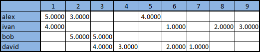
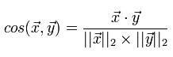
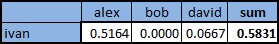
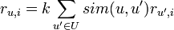
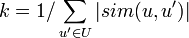
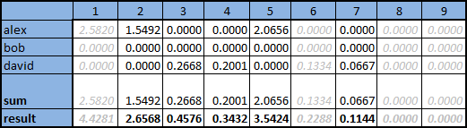

# Introducton

To build recomendation I decided to create model that will predict scores for all the movies in the library.

# Data analysis

* During EDA I found that users' ratings dataset is clean (without corrupted data and missed values). All the described in dataset's README parameters are true.

* Addtionaly I explored distribution of data in `u1` split of data. Train part has ratings from all the 943 users. Test part has ratimg only for 459 users.

# Model Implementation

I decided to implement from scratch variant of `Collaborative Filtering Model`. 

My model uses only ratings information without users' personal data.

1. At first we need to convert our rating in form:

    |user_id|item_id|rating|
    |:-:|:-:|:-:|
    |1|1|5|
    |1|2|3|
    |2|2|2|

    to the follwing matrix:

    | | film_1| film_2 |
    |:-:|:-:|:-:|
    |user_1|5|3|
    |user_2|0|2|

    _(in our case zero means tha there is no rate from user)_

    

2. Now we need to define distance function between users. I decided to use cosine similarity of users' scores

    

    

3. For the given user we choose **N** users which are the closest to ours. For every user in **N** we multiply his ratings by similarity score. 

4. Finally, we sum obtained weighted ratings for all the movies. In the end we should devide summed rating of all movies by sum of cosine similarities of our **N** users. Obtained values are predicted ratings of films for target user.

    

    The `sim` function is the measure of similarity of two users chosen by us, `U` is the set of users, `r` is the score, `k` is the normalization coefficient

    

    

# Model Advantages and Disadvantages

Advantages:

* There is no training process, we need just initialize model with data

* Interpretabilty

Disadvantages:

* We need to store sparse matrix with users' ratings

* Inference of model slows down as number of data grows

* Model does not use users' personal data

# Training Process

Implemented model does not have training step but it has a hyperparameter. We need to define number of users **N** to use while counting scores.

For this assignemnt I used dataset's first train test splitting `u1`.

I decided to choose best **N** with use of `Optuna`. I divided train part of the dataset into train and valid parts (80% and 20%). Valid part was used to count metrics to define which **N** is the best. This process ended with value of 22 users (it is stored in `/models/params.json`).

# Evaluation

## Settings

For evaluation I used dataset's first train test splitting `u1` and two baseline models.

All the three resulting models were fit on the same train part and evaluated on the test part.

The first baseline is **Random Model**. It generates random ratings from 1 to 5 for all the movies.

The second baseline is **Average Model**. It returns average ratings for all users.

## Metric

It is not clear from what rating we want to show films to the user (is it 3, 4 or 5). This is why I decided not to use **MAP@k** metric.

We can look at the problem of recommendations from the other side. We can try to predict scores to movies which are unseen by our target user. After such prediction we can recommend user movies with the highest preedicted ratings.

To evaluate such a process RMSE metric is usually used. We will count error in terms of differences between predicted films' ratings and user's ratings

# Results

The results are surprising. Collaborative filtering model showed the worst results:

|Model|RMSE|
|:-:|:-:|
|Random|2.11|
|Average|1.01|
|Collaborative Filtering|2.51|

As we can see implemented algorithm is not effective (worse than random one). It may be improved by using SVD and users' personal data.

Such an untrainable algorithm is depends a lot on data distribution as it can not generalize.